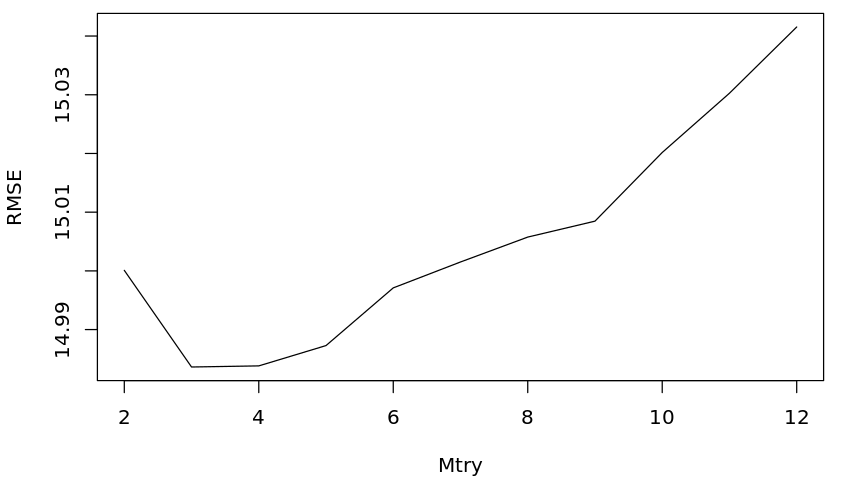
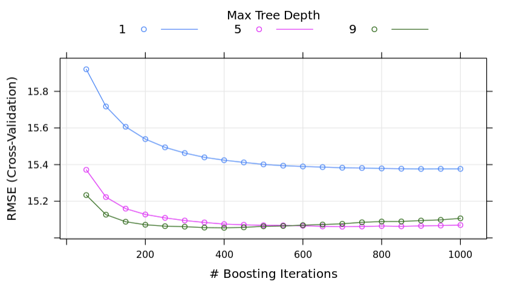
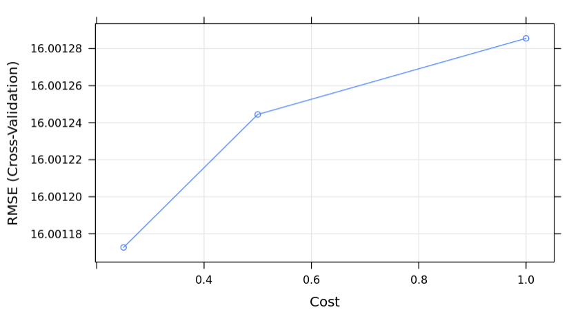
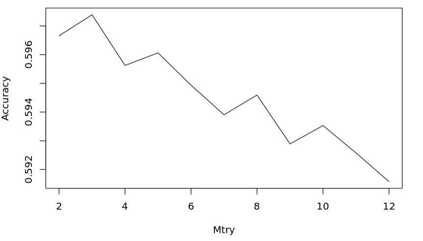
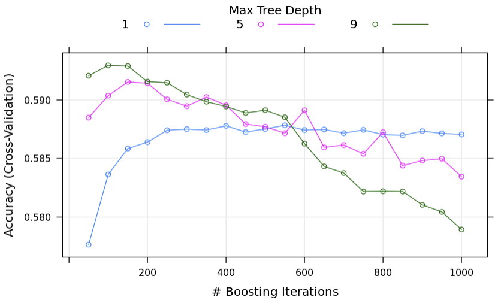
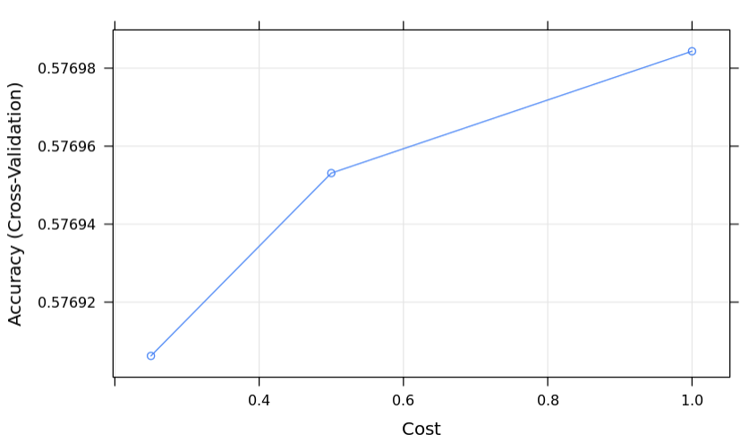
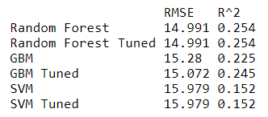
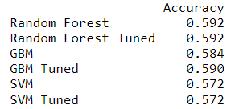
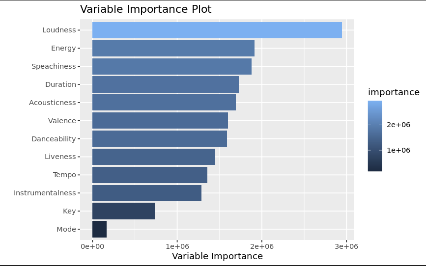
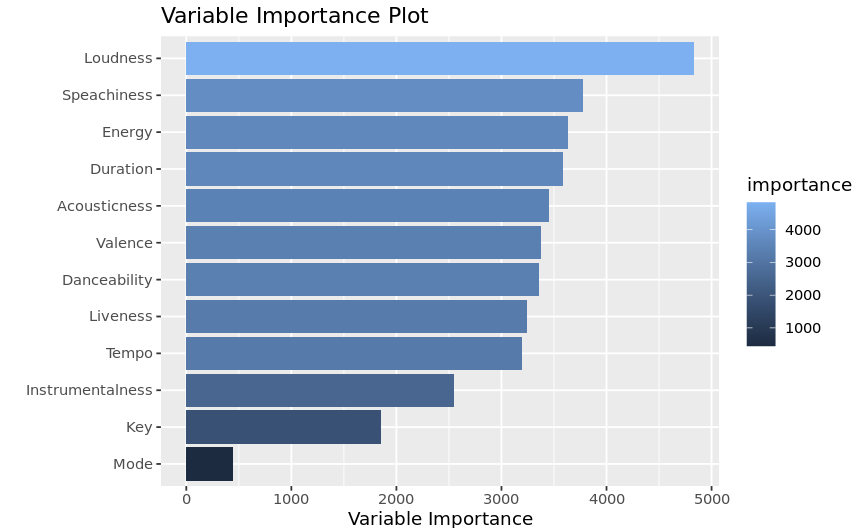

\newpage 
\tableofcontents 
\listoffigures
\listoftables
\newpage   
    
```{r setup, include=FALSE}
knitr::opts_chunk$set(tidy.opts=list(width.cutoff=80), tidy=TRUE)
library(caret)
library(dplyr)
#library(lmtest)
#library(randomForest)
#library(gbm)
#library(glmnet)
#library(e1071)
#library(foreach)
#library(doParallel)
#library(ranger)
#library(abcrf)
#library(xgboost)
#library(kernlab)
library(tidyverse)
#library(spotifyr)
library(MASS)
library(stringi)
library(parallel)
library(data.table)
library(plyr)
library(foreach)
library(reticulate)
library(formatR)

library(kableExtra)
library(tidyverse)
library(Hmisc)
library(janitor)
library(stringr)
library(rstatix)
library(FactoMineR)
library(factoextra)
library(reshape2)
library(corrplot)
library(shiny)
library(bookdown)
```

# Abstract

Spotify is an audio streaming service used by hundreds of millions of people. The popularity of Spotify songs is described by a popularity index and each song is associated with features that quantify various sonic attributes (e.g. pitch, daceability, etc.). For this group project, we sought to generate statistical models that can predict the popularity of a song based on these sonic attributes. We constructed a Spotify songs database using custom R and Python scripts to query the Spotify API and appended it to a similar, publicly available database. Song popularity was predicted using several models, whose performance and runtime were benchmarked and compared.

# Introduction

[Spotify](https://open.spotify.com) is a web-based audio streaming service, first launched in 2008, with 456 million users, including 195 million subscribers across 183 markets. The popularity of each song is quantified using a numeric popularity index from 0-100. Each song is also associated with metadata including genre, artist, and several attributes that describe various acoustic/sonic features:

- acousticness
- danceability
- durations
- energy
- instrumentalness
- key
- liveness
- loudness
- mode
- speechiness
- tempo
- valence

We sought to model the song popularity index using the acoustic attributes in a large database of Spotify songs. There are several publicly available Spotify song datasets, but these are outdated. Additionally, we sought to develop a novel means of accessing song data from the Spotify API. 

Our *fist objective* was to create a new, updated dataset of Spotify songs. We attempted to accomplish this by generating random song IDs and using these to search the Spotify API. 

Our *second objective* was to model song popularity (dependent variable) from the acoustic attributes (independet variables). Others have attempted to model popularity from the acoustic attributes and genre, but most used linear models that had poor performance. For this project, we utilized alternative approaches to modeling/predicting song popularity from acoustic attributes and compared them with respect to performance and runtime.

# Methods

Would it be better to include a general description of the methods here? Maybe a discussion of how the random song IDs were generated and used to scrape the API?

# Results and Discussion

## Sampling Techniques

### Issues generating random sample

Randomly sampling the spotify catalog is a difficult task that is beyond the timeframe and
computing power available to our cohort. Spotify randomly assigns each music track a twenty one character id. The first character is always numeric but the remaining characters are case sensitive alphanumeric characters with repetition. Thus, we have a sample space of  $(62^{20})(10)$ but the actual sample space of spotify tracks is a much smaller subset of the total sample space (approximately $1.41^{-28}$ of the sample space). Below we implemented the stringi package to generate random id's.Unfortunately, due to the time it would take to generate a random sample this way and that the spotify API limits the number of inquiries a developer can make we would not be able to generate a sample this way. 

```{r,eval=FALSE, "Random Sampling function"}
spot_id_track_check<- function(x) get_tracks(x)

spot_ids<-function(Length){
  
st_int<- stri_rand_strings(1, 1, "[0-9]")
st_char<-stri_rand_strings(as.integer(Length), 21, pattern = "[A-Za-z0-9]")
spot_id<-seq(st_int)
for (i in spot_id){
 spot_id[i]<-paste(st_int[i],st_char[i],sep="")}

xt<-do.call(c,replicate(n=Length,mclapply(spot_id,function(x){spot_id_track_check(x)},mc.cores = 48)))
return(xt)
}  
songs<-spot_ids("1000")
songs

```

We decided to use the function _search_spotify_ to return tracks from randomly generated strings.The function allows developers to search Spotify tracks by matching strings. Below are several examples of pseudo random samples using shell script, R, and Python. 

\newpage 
### Bash sampling script
```{bash, engine.opts='-l',eval=FALSE}

# Bash script to search for random ids for Spotify tracks using the web API.
# STAT 447
# Giang Le
# Usage: bash spotify_scraping.sh $CLIENT_ID $CLIENT_SECRET
# bash spotify_scraping.sh 7c83827741ee4cbc9bd117a9cf608a39 9c2a651fdabd472892b873644f774b09

#CLIENT_ID=$1
#CLIENT_SECRET=$2

#creds=$CLIENT_ID:$CLIENT_SECRET
#encoded_creds=$(echo -n $creds | base64)

access_token=$(curl -s -X "POST" -H "Authorization: Basic $encoded_creds" -d grant_type=client_credentials https://accounts.spotify.com/api/token | awk -F"\"" '{print $4}')
echo $access_token
rm result.json extracted_ids.txt
for x in {a..z}
do
curl --request GET --url "https://api.spotify.com/v1/search?q=%25"$x"%25&type=track&limit=50&market=US" --header "Authorization: Bearer $access_token" --header "Content-Type: application/json" >> result.json
done

cat result.json | grep -o "\"id\" :.*" | sed 's/"id" : "//g' | sed 's/",$//g' >> extracted_ids.txt


```

### R sampling script
```{r, eval=FALSE}
# R script to sample tracks using spotifyr package


# function ran inside mylist function to get audio features of sampled tracks
spot_id_track_check<-function(x) get_track_audio_features(x)  

mylist<-function(x){
  xL<-c()
  st_char<-stri_rand_strings(2, x, pattern = "[A-Za-z0-9]")## generate random strings to sample from spotify search
  xL<-foreach(i=st_char) %do% {  
    #search track returns tracks from spotify API
    search_spotify(
      i,
      type = "track",
      market = NULL,
      limit = 50,
      offset=0,
      include_external = NULL,
      include_meta_info = FALSE)
    
  }
  xt<-xL
  # bind 
  sp_s<-bind_rows(xt, .id = "column_label")
  x_id<-sp_s$id
  
  ## get audio track features
  sp_f<-spot_id_track_check(x_id)  
  
  ## return two dataframes,track information and audio features 
  return(list(sp_s,sp_f))
}
sp_feat<-mylist(x)

### Replicate function to get large dataset of spotify tracks
x<-replicate(n=200, mclapply(3,function(x){mylist(x)},mc.cores = 48))

# remove NA
sp_f2<-x[!(is.na(x ))]

## Beind and seperate dataframes to then reincorporate into one dataframe
sp_s1<-bind_rows(x[1:200],.id = "column_label")
sp_s2<-sp_s1[!(is.na(sp_s1$explicit )),]
sp_s2<-sp_s2[,1:30]


sp_f2<-sp_s1[(is.na(sp_s1$explicit)),]
sp_f2<-sp_f2[,31:44]

sp_all<-cbind(sp_s2,sp_f2)

sp_s2[3,]
sp_f2[3,]
SP_ALL<-sp_all

#########################################
#Check if all track id's are unique, if not second line removes duplicates
length(unique(SP_ALL$id))
sp_all_unique<-SP_ALL[!duplicated(SP_ALL[8]),]

#######################################


```


### Python sampling script
```{python, eval=FALSE}

# Python script to sample tracks

import csv
import itertools
import string

import pandas as pd
import spotipy
from spotipy.oauth2 import SpotifyClientCredentials


class CrawlerSpotify:
    def __init__(self, client_id, client_secret):
        # authorization information
        self.id = client_id
        self.secret = client_secret
        self.spotify = spotipy.Spotify(client_credentials_manager=
                                       SpotifyClientCredentials(client_id=self.id, client_secret=self.secret))

    def save_tracks(self, output_path: str = None):
        search_words = self._generate_search_words()  # generate search words

        results = []
        for sq in search_words:  # iterate search words
            search_results = self.spotify.search(q=sq, type='track', limit=50)
            total = search_results['tracks']['total']
            print(f'===== A total of {total} results from search word: {sq} =====')

            for offset in range(0, total if total < 1000 else 1000, 50):  # iterate pages.
                # for each search word, the API returns 1000 results at most,
                # so we can get maximum 20 pages for each search word (50 tracks each page)
                # see https://developer.spotify.com/documentation/web-api/reference/#/operations/search
                print(f'results from page {int(offset / 50 + 1)}')
                tracks = self._parse_tracks(self.spotify.search(q=sq, type='track', limit=50, offset=offset))
                audio_features = self.spotify.audio_features([track['track_id'] for track in tracks])  # audio features
                result = [{**track, **self._parse_audio_features(audio_feature)} if audio_feature else track for
                          track, audio_feature in
                          zip(tracks, audio_features)]  # combine track details and audio features
                self._save_csv(result, output_path)  # save to csv
                results.append(result)

        return pd.DataFrame(results)

    @staticmethod
    def _save_csv(result, output_path: str):
        csv_header = ['track_id', 'track_name', 'track_artist', 'track_popularity', 'track_album_id',
                      'track_album_name', 'track_album_release_date', 'danceability', 'energy', 'key',
                      'loudness', 'mode', 'speechiness', 'acousticness', 'instrumentalness', 'liveness',
                      'valence', 'tempo', 'duration_ms']

        with open(output_path, 'a', newline='', encoding='utf-8-sig') as fp:
            csv_writer = csv.DictWriter(fp, csv_header)
            if fp.tell() == 0:
                csv_writer.writeheader()
            csv_writer.writerows(result)

    @staticmethod
    def _parse_tracks(search_results):
        """
        extract useful data from search results
        """
        details = []
        for track in search_results['tracks']['items']:
            details.append({
                'track_id': track['id'],
                'track_name': track['name'],
                'track_artist': track['artists'][0]['name'],
                'track_popularity': track['popularity'],
                'track_album_id': track['album']['id'],
                'track_album_name': track['album']['name'],
                'track_album_release_date': track['album']['release_date']
            })
        return details

    @staticmethod
    def _parse_audio_features(audio_feature_results):
        """
        delete unnecessary data from audio feature results
        """
        del_key = ['type', 'uri', 'track_href', 'analysis_url', 'time_signature', 'id']
        return {key: audio_feature_results[key] for key in audio_feature_results if key not in del_key}

    @staticmethod
    def _generate_search_words():
        """
        generate search words. from letters a-z and numbers 0-9, with years 1985-2022
        """
        search_words = []
        for word, year in itertools.product(list(string.ascii_lowercase) + list(range(0, 10)), list(range(1985, 2023))):
            search_words.append(f'{word} year:{year}')
        return search_words


if __name__ == '__main__':
    my_client_id = 'Your Client ID'
    my_client_secret = 'Your Client Secret'
    my_output_path = r'result_spotify.csv'

    crawler = CrawlerSpotify(client_id=my_client_id, client_secret=my_client_secret)
    data_tracks = crawler.save_tracks(output_path=my_output_path)  # 1,368,207 tracks

    # delete duplicates
    data = pd.read_csv(my_output_path)
    data_final = data.drop_duplicates().reset_index(drop=True)  # 573,131 tracks
    data_final.to_csv(r'result_spotify_noduplicates.csv', index=False, encoding='utf-8-sig')
    # data_final['loudness'].isna().sum()  # 615 tracks can not extract audio features

```
\newpage 

## Data Preparation and Cleaning

Scraping the Spotify API resulted in the generation the three datasets of Spotify Songs. These datasets were cleaned and combined to generate a single database of songs.

```{r}

list.files()
songs <- read.delim("Combine_UniqueTracks.txt", sep = ",")

songs2 <- read.csv("data_part2.txt")

songs3 <- read.csv("data_part1.txt")

```

Synchronize column names and order:

```{r}
colnames(songs)

table(colnames(songs2) == colnames(songs3))

```

```{r}
songs <- songs[, -c(1, 18)]
songs2 <- songs2[, -c(1, 6:8)]
songs3 <- songs3[, -c(1, 6:8)]
```

```{r}
names(songs2) <- colnames(songs)

names(songs3) <- colnames(songs)

```

Combine all datasets:

```{r}
songs_combined <- rbind(songs, songs2, songs3)
```

Scan for duplicates:

```{r}
dupes <- songs_combined %>% 
  janitor::get_dupes(TrackID)

#nrow(dupes)

```

There were `r nrow(dupes)/2` duplicate track IDs in the combined dataset. These duplicated rows were removed. 

```{r}
songs_combined <- songs_combined %>%
  filter(duplicated(TrackID) == FALSE)
```

Confirm that duplicate rows have been removed: 

```{r}
songs_combined %>% janitor::get_dupes(TrackID) %>% nrow
```

The "mode" attribute codes whether the song is written in a major or minor key and is stored as a binary numeric variable (0 = minor; 1 = mojor). For interpretability, this attribute was decoded.

```{r}
songs_combined$Mode <- case_when(songs_combined$Mode == 1 ~ "Major",
                                songs_combined$Mode == 0 ~ "Minor")
```

Similarly, each song's key is stored as a numeric variable and was decoded for interpretability:

```{r}

songs_combined$Key <- case_when(
  songs_combined$Key == 0 ~ "C",
  songs_combined$Key == 1 ~ "C#/Db",
  songs_combined$Key == 2 ~ "D",
  songs_combined$Key == 3 ~ "D#/Eb",
  songs_combined$Key == 4 ~ "E",
  songs_combined$Key == 5 ~ "F",
  songs_combined$Key == 6 ~ "F#/Gb",
  songs_combined$Key == 7 ~ "G",
  songs_combined$Key == 8 ~ "G#/Ab",
  songs_combined$Key == 9 ~ "A",
  songs_combined$Key == 10 ~ "A#/Bb",
  songs_combined$Key == 11 ~ "B"
)

```

Finally, the popularity index was quantized in order to convert it from a numeric to a categorical variable. This will be useful for classification models that require categorical independent variables. 

```{r}

songs_combined <- songs_combined %>% 
  mutate(Popularity_quantized = cut(Popularity, breaks=c(0, 25, 50, 75, 100), 
                                    include.lowest = TRUE))

#table(songs_combined$Popularity_quantized)

songs_combined$Popularity_quantized <- factor(songs_combined$Popularity_quantized)

#levels(songs_combined$Popularity_quantized)

```

Finally, remove rows with NA values

```{r}
songs_combined <- songs_combined %>% drop_na()
```


## Exploratory Analysis

There were `r nrow(songs_combined)` songs from `r length(unique(songs_combined$Artist))` artists in the combined Spotify Songs dataset. 

### Song Popularity

Distribution of song popularity indices:

```{r}
hist(songs_combined$Popularity, main = "Distribution of Song Popularity Indices")
```

Here is Shiny capability to try out

```{r}
sliderInput("bins", "Number of bins:", 30, min = 1, max = 50)

renderPlot({
  x    = songs_combined$Popularity 
  bins = seq(min(x), max(x), length.out = input$bins + 1)

  # draw the histogram with the specified number of bins
  hist(x, breaks = bins, col = 'darkgray', border = 'white')
})
```

Distribution of quantized popularity indices:

```{r}
quant_pop <- data.frame(table(songs_combined$Popularity_quantized))

names(quant_pop)[1] <- "Quantized Popularity"

ggplot(quant_pop, aes(x=`Quantized Popularity`, 
                      y = Freq, 
                      fill = `Quantized Popularity`)) +
  geom_bar(stat = "identity") +
  geom_text(aes(label = Freq), vjust=0) +
  theme_bw() +
  ggtitle("Quantized Popularity Frequencies")

```

```{r}
kable(quant_pop)
```


Clearly, popular songs are rare in this dataset and the majority of songs had low popularity. 

The top twenty most popular songs:


```{r}
songs_combined %>% 
  arrange(desc(Popularity)) %>% 
  dplyr::select(SongName, Artist, Popularity) %>% 
  top_n(20) %>% kable 
```


Now, the interactive, shiny version of the table - the user can select how many songs to look at.

```{r, echo = FALSE}
numericInput("rows", "How Many Songs?", 5)

renderTable({
  songs_combined %>% 
  arrange(desc(Popularity)) %>% 
  dplyr::select(SongName, Artist, Popularity) %>% 
  top_n(input$rows)
})

```

## Acoustic Attributes

Distributions of acoustic variables (raw data):

```{r}

hist.data.frame(songs_combined[, c(5:6, 8, 10:16)]) 

```


### Principal Component Analysis

```{r, include=F}

num_cols <- unlist(lapply(songs_combined, is.numeric))
                   
pca <- PCA(songs_combined[, c(5:6, 8, 10:16)], graph = F, scale.unit = T)

fviz_eig(pca)

summary(pca)

#summary(pca)

```


```{r}
#format pca data for plotting

dat_pca <- data.frame(pca$ind$coord[, 1], pca$ind$coord[, 2])

names(dat_pca) <- c("PC1", "PC2")

pca.vars <- pca$var$coord %>% data.frame

pca.vars$vars <- rownames(pca.vars)

pca.vars.m <- melt(pca.vars, id.vars = "vars")

dat_pca$Popularity_quantized <- factor(songs_combined$Popularity_quantized)

dat_pca <- dat_pca %>% na.omit()

ggplot(data = dat_pca, aes(x = PC1, y = PC2, color = Popularity_quantized)) +
  scale_color_manual(values = c("blue", "orange", "green", "purple")) +
  geom_hline(yintercept = 0, lty = 2) +
  geom_vline(xintercept = 0, lty = 2) +
  guides(color = guide_legend(title = "Song Popularity (Quantized)")) +
  scale_shape_manual(values = c(15, 16, 16, 17, 18)) +
  geom_point(alpha = 0.5, size = 1) + 
  xlab("PC 1 (33.3%)") + 
  ylab("PC 2 (14.7%)") +
  facet_wrap(vars(Popularity_quantized)) +
  theme_minimal() +
  theme(panel.grid = element_blank(), 
        panel.border = element_rect(fill= "transparent")) +
  theme(legend.position="bottom") + 
  theme(legend.title=element_text(size=14), 
    legend.text=element_text(size=12)) +
  ggtitle("PCA of Acoustic Attributes")


```

Because there are so many datapoints, the PCA plots are faceted by the quantized popularity indices. 


Interactive Shiny PCA plot:

```{r}

fluidRow(style = "padding-bottom: 20px;",
        column(4, selectInput('group', 'Popularity Index (Quantized) Group', dat_pca$Popularity_quantized)),
        column(4, selectInput('color', 'Group Color', c("blue", "orange", "green", "purple"))))


renderPlot({
  ggplot(data = dat_pca[dat_pca$Popularity_quantized == input$group, ], aes(x = PC1, y = PC2, 
                                                                            color = Popularity_quantized)) +  
  geom_point(alpha = 0.5, size = 1) + 
  scale_color_manual(values = input$color) +
  geom_hline(yintercept = 0, lty = 2) +
  geom_vline(xintercept = 0, lty = 2) +
  scale_shape_manual(values = c(15, 16, 16, 17, 18)) +
  xlab("PC 1 (33.3%)") + 
  ylab("PC 2 (14.7%)") +
  theme_minimal() +
  theme(panel.grid = element_blank(), 
        panel.border = element_rect(fill= "transparent")) +
  theme(legend.position="bottom") + 
  theme(legend.title=element_text(size=14), 
    legend.text=element_text(size=12)) +
  ggtitle("PCA of Acoustic Attributes (Interactive)")

  
})

```


### Correlation Analysis

Here we sought to determine if sonic attributes are correlated with song popularity.

```{r}

#this takes a couple of minutes to run

songs_combined[, c(4, 5:6, 8, 10:16)] %>%
  gather(-Popularity, key = "var", value = "value") %>% 
  ggplot(aes(x = value, y = Popularity)) +
    geom_point(size = 1) +
    facet_wrap(~ var, scales = "free") +
    theme_bw()
```
Most acoustic variables do not appear to be correlated with song popularity. However a few possible relationships are apparent:

 - Dancability is positively correlated with popularity
 - Duration is negatively correlated with popularity
 - Loudness is positivelt correlated with popularity
 - Speachiness is negatively correlated with popularity
 
Pearson Correlation Coefficients:

```{r}

cor.res <- songs_combined[, c(4, 5:6, 8, 10:16)] %>% 
  cor_test(Popularity, method = "pearson")

cor.res$FDR <- qvalue::qvalue(cor.res$p, pi0 = 1)$qvalues

cor.res

#cor.res[cor.res$FDR<0.05, c(1:3, 5, 9)] %>% arrange(cor)
```


Plot correlations among all acoustic variables and popularity (Pearson)

```{r}

all_cor <- cor(songs_combined[, c(4, 5:6, 8, 10:16)], method = "pearson")

corrplot(all_cor, type = "upper", order = "hclust", 
         tl.col = "black", tl.srt = 45)

```

\newpage 

## Modeling Analysis

Using the whole dataset, the models take too long to run. With greater computational resources, the models can be run on the entire dataset. For the purposes of this project, the models were run on a smaller subset of rows selected randomly from the whole data. 


```{r}

set.seed(1221)
obs <- sample(1:nrow(songs_combined), 80000)
subdata <- songs_combined[obs,]

```

The data was then divided into a training set and a testing set in an 80%/20% split, respectively.

```{r}

set.seed(447)
samp_size <- floor(0.8 * nrow(subdata))
idx <- sample(seq_len(nrow(subdata)), size = samp_size)

train <- subdata[idx,]
test <- subdata[-idx,]

#Check final dimensions for training and testing set
dim(train)
dim(test)

```

### Regression models

For the regression analysis, the response variable is *Popularity*. The predictors are listed as follows:

- acousticness
- danceability
- durations
- energy
- instrumentalness
- key
- liveness
- loudness
- mode
- speechiness
- tempo
- valence

The following models were processed using the predictors listed above in the training data, and model predictions were evaluated against the testing data. The metrics used to evaluate model fit were root mean squared error (RMSE) and $R^2$. A good model fit will have a lower RMSE and a higher $R^2$ value. Model parameters were then tuned to try to optimize the model to obtain a better fit.

####  1) Random Forest

The random forest model is an ensemble learning method that constructs decision trees with a random selection of a subset of the predictors. The number of predictors selected for this subset is a parameter in this model known as mtry. For regression, the output of the random forest is the number selected by the majority of the trees based on the predictor values. The initial random forest model that was run included the default mtry parameter = 3 using 500 trees. The resulting RMSE and $R^2$ values evaluated against the testing data were 14.99 and 0.254, respectively.

The random forest model was then tuned via 5-fold cross validation to determine the optimal value of mtry. Since there are 12 predictors, the model was re-run using mtry values ranging from 2-12, and the model that had the lowest RMSE was selected as the optimal model. The model with mtry = 3 had the lowest RMSE, so our initial model was already the optimal model. 



####  2) Gradient Boosting Machine

Gradient boosting machines (GBM) are another type of ensemble machine learning algorithms that can be used for regression. Gradient boosting is an optimization problem with the goal of minimizing the model’s loss by adding one weak learner at a time using a gradient descent algorithm. The weak learners in gradient boosting are decision trees. The decision trees are built such that their split values are determined based on minimizing the loss. The GBM that was run included the default max tree depth parameter = 3 and number of iterations parameter = 150. The resulting RMSE and $R^2$ values evaluated against the testing data were 15.28 and 0.225, respectively.

The GBM was then tuned via 5-fold cross validation to determine the optimal parameter values. The max tree depth values that were tested were 1, 5, and 9, and the number of iterations tested ranged from 50 to 1000 by increments of 50. The model with max tree depth = 9 and number of iterations = 400 had the lowest RMSE, so the GBM was re-run using these parameters. The resulting RMSE and $R^2$ values were 15.07 and 0.245, respectively.



####  3) Support Vector Regression

Support vector machines (SVM) are large margin classifiers. Support vector regression is a machine learning algorithm that finds an appropriate line or hyperplane that fits the data within a specified threshold. Here, we are fitting a linear kernel. The support vector regression model that was run included the default cost parameter = 1. This cost parameter can adjust for how much the large margin classification should be. The resulting RMSE and $R^2$ values were 15.98 and 0.152, respectively.

The support vector regression was then tuned via 5-fold cross validation to determine the optimal cost parameter. The cost values that were tested were 0.25, 0.5, and 1. The model with cost = 0.25 had the lowest RMSE, so the support vector regression was re-run using this parameter value. The resulting RMSE and $R^2$ values were 15.98 and 0.152, respectively.



\newpage 
### Classification Models

For the classification analysis, the response variable is *Popularity_quantized*. The predictors remain the same as regression.

The metric used to evaluate model fit was accuracy. A good model fit will have a higher accuracy value. Similar to regression, model parameters were then tuned to try to optimize the model to obtain a better fit.

####  1) Random Forest

The random forest model for classification is similar to the random forest model for regression except the output of the random forest is the class selected by the majority of the trees based on the predictor values. The initial random forest model was run, and the resulting accuracy evaluated against the testing data was 0.592.

The random forest model was then tuned similar to regression, and the model with mtry = 3 had the highest accuracy, so our initial model was already the optimal model again. 



####  2) Gradient Boosting Machine

GBM can also be used for classification. The initial GBM was run, and the resulting accuracy evaluated against the testing data was 0.584.

The GBM was then tuned similar to regression, and the model with max tree depth = 9 and number of iterations = 100 had the lowest accuracy, so the GBM was re-run using these parameters. The resulting accuracy was 0.590.



####  3) Support Vector Machine

SVM was used for classification. Here it tries to find an appropriate margin that separates the classes and also reduces the risk of error on the data. A linear classifier was used similar to regression. The initial SVM model was run, and the resulting accuracy evaluated against the testing data was 0.572.

The SVM model was then tuned similar to regression, and the model with cost = 1 had the highest accuracy, so our initial model was already the optimal model. 



\newpage 
## Results

Below is a summary table of the regression and classification model metrics. The random forest model appears to perform the best for both regression and classification because it has the lowest RMSE and highest accuracy, respectively. This means it is a good model to predict both a popularity score as well as a popularity class given these predictors.

On the other hand, the SVM model appears to perform the worst for both regression and classification. This suggests a linear classifier may not be good enough to predict popularity. However, the model metrics are still pretty close to each other and aren't too far apart. Given more time, we could look into other possible kernels such as a polynomial or radial kernel, for example, to better match the shape of the data. We could also look into tuning other parameters in the random forest model such as the number of trees parameter to further improve the model fit.





Here's a breakdown of the importance of each of the predictors from the random forest model for both regression and classification. The plots are similar except for the small discrepancy in the order of importance for *Energy* and *Speachiness*.

The variable that has the most impact in predicting song popularity is *loudness* with a huge margin. *Key* and *Mode* have the least impact in predicting song popularity. This makes sense because the average person would not normally know the key or mode of a song.

####  Regression


####  Classification



\newpage 
## Shiny app?

\newpage 
## Conclusion

\newpage 
## References